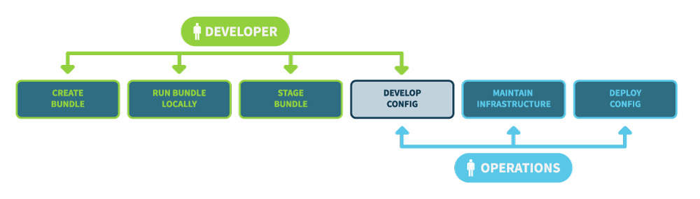
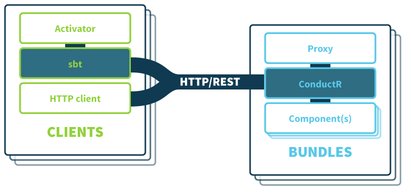

# Typesafe ConductR %PLAY_VERSION%

## Introduction

Quoting the [Reactive Manifesto](http://www.reactivemanifesto.org/):
> Application requirements have changed dramatically in recent years. Only a few years ago a large application had tens of servers, seconds of response time, hours of offline maintenance and gigabytes of data. Today applications are deployed on everything from mobile devices to cloud-based clusters running thousands of multicore processors. Users expect millisecond or even microsecond response times and 100% uptime.

The Typesafe ConductR is a technology for Operators to manage and deploy applications based on the Typesafe Reactive Platform (Typesafe RP). Typesafe ConductR belongs to a new generation of application server that manages applications as processes across a networked cluster. Typesafe ConductR is light and unencumbered in its design, leveraging our expertise of the Reactive domain.

Typesafe ConductR provides an easy, consistent and dependable solution to facilitate the full lifecycle of applications built using the Typesafe RP. These activities demand a coordinated configuration in terms of upgrades across clusters of machines, operating systems, processes and services, all with zero downtime.

## Glossary

Term        | Description
         ---|---
Application | A collection of one or more bundles representing a meaningful business purpose. A Developer determines what constitutes an Application. Typesafe ConductR recognises the aggregation of bundles through a "system" attribute assigned to the bundle. This attribute can be used by a component to associate themselves with an Akka cluster (for example).
Bundle      | A bundle is an archive of components along with meta data (a bundle descriptor file) describing how the files should be executed. Bundles are similar to executable JARs with the difference being that they are not constrained to executing just JVM code. Bundles are also named using a digest of their contents so that their integrity may be assured. Bundles represent a unit of software that may have a release cycle which is distinct from other bundles.
Component   | A bundle can have many components although it typically has just one. A component in Typesafe ConductR represents a unit of software that  describes what will become a process when a bundle is started.
Configuration | Configuration alters a component's behavior at runtime and may declare the location of a database, credentials, logging file levels and so forth. Configuration is primarily sourced from within a bundle's components. In addition external configuration may be applied across all of a bundle's components when a bundle is loaded. This additional configuration would typically relate to values for production, testing and so forth.
Developer   | Developers who develop using Scala/Java, Akka, Play and/or other Typesafe technologies.
Operator    | Targets the "linux admins" of the Ops world and covers both IT Ops and Dev Ops style roles.
Service     | An Application can be broken down into logical services, comprised of generalised services or not even have services. What constitutes a service is left to the Developer. Typesafe ConductR recognises the aggregation of bundles through a "system" attribute assigned to the bundle. This attribute can be used by a component to associate itself with an Akka cluster (for example).

## Functional Scope

The following use-case diagram illustrates the scope of Typesafe ConductR:



During the latter part of development of a project developers will typically package their artifacts and start running them for near-production style scenarios. An example of this is with a Play application development. During the early stages developers will typically run their project from within Activator, making changes to their code having gathered rapid feedback from the browser window. Once most of the project's functionality is written developers will then issue a "stage" command to produce a distribution on the file system that they can run their project from. The project will run differently given things such as CDN resolution, asset fingerprinting, minification; activities that would otherwise degrade the speed required for development mode. As a part of the staging activity build tools permit the staging of a bundle that can be used by Typesafe ConductR ( _Create Bundle_ and _Run Bundle Locally_). This bundle is able to be deployed and run on the developer's machine.

During the course of development the developer will create a configuration that is also used for running a bundle locally ( _Develop Config_). This configuration names a project's component declaring its environmental requirements. These configurations are versioned and provide an audit trail of the changes to a component overall.

When a component is ready for deploying (for example, into testing or production) the developer will provide the component's bundle to operations ( _Stage Bundle_). Operations will develop a component's configuration further for suitability with target environments ( _Develop Config_). Not only can configurations be versioned but they can also be isolated in terms of target environments. For example there may be a configuration targeting production deployment, another for functional testing and so forth. Once configurations have been developed they can be deployed. Staged bundles are referenced by the deployed configuration and are deployed onto infrastructure as a consequence. Operations also take care of preparing physical or virtual hardware and operating systems in order that they can receive these deployments. Operations are responsible for maintaining Typesafe ConductR by configuring networks, databases and so forth. ( _Maintain Infrastructure_).

## Solution Architecture

### Overview

The following component diagram illustrates the components of Typesafe ConductR:



Typesafe ConductR fundamentally consists of the _ConductR_ process; an application that is responsible for deploying components throughout a medium to large networked cluster of machines. We see that a medium sized cluster begins at where more than 3 host machines are involved. ConductR provides a control protocol via HTTP/REST/JSON so that many types of client may communicate with it.

### Clients

Many types of client are possible given HTTP/REST/JSON. For developers, an sbt plugin named `sbt-typesafe-conductr` provides control protocol commands (load, unload, start etc.) for managing the lifecycle of bundles. Similarly for operators, a set of command line tools are provided and can be run on Windows and Unix style environments.

Again for developers, [Typesafe Activator](http://typesafe.com/activator) can also communicate with Typesafe ConductR. Activator communicates with sbt via the sbt-server protocol and so all tasks and settings available to the sbt-typesafe-conductr plugin will be available to Activator. Therefore Activator can be used to prepare bundles and publish them to the cluster, or on a local machine for testing.

### Bundles

Typesafe ConductR provides an `sbt-bundle` plugin to produce bundles. The plugin is as an extension of the [sbt-native-packager](https://github.com/sbt/sbt-native-packager#sbt-native-packager) plugin. Bundles are `zip` files that are named in accordance with their calculated digest. They contain the following files:

* A bundle descriptor file named `bundle.conf`
* The files relating to the component under a directory named under the component's name/version combination

A bundle descriptor file ( _bundle.conf_) contains the following information:

* the version of the bundle format
* the version of the component for human audit purposes
* a human-readable name of the component along with a description
* the Akka cluster role that corresponds with the component e.g. "web-server"
* the type of container e.g. Universal, Docker (optional), rpm and anything else that the native packager can produce
* the command line required to execute the component
* an optional declaration of how external network endpoints will be required to be mapped to a component's

#### Docker

Docker is the supported container technology. Typesafe ConductR abstracts Docker interactions so that:

* a container image is built using files belonging to a component described by a bundle
* the container's dynamic ports (if any) can be supplied in order to avoid conflicting with any non Docker ports in use

This abstraction also allows other forms of container to be supported by Typesafe ConductR in the future.

Note also that a bundle's components do not have to run within a container. They may also run within the same host as the ConductR if required. When considering JVM applications we encourage the container-less approach as it can minimise start-up times. Consider Docker for use-cases when you have a native component that profits from the "write once, run anywhere" goal of containers.

#### Proxying Network Endpoints

A strong requirement of Typesafe ConductR is to strive for the 100% availability of services. For example, there should be no disruption to the availability of a component's service due to upgrades.

In order to meet this requirement the proxying of network traffic where a static port is mapped to a number of dynamically allocated ports is required. For example, suppose there is a component with a configuration of _x_. The component provides an https service on port 443 and manages all requests given a path of "/someservice". Supposing also that there is a virtual IP address of 192.168.1.123 allocated to a number of nodes in the cluster then the following external request for `/someservice` will be routed to our component running on any one of a number of hosts:

```
GET https://192.168.1.123:443/someservice
```

If the component is required to be loaded again, but with a new configuration of _y_ then we must load the component into the cluster while the one with configuration _x_ remains available. If we did not do this then there would be a period of unavailability between unloading the component with _x_ and then loading it with _y_ given that the components compete for the same external port.

In order to avoid port contention we have just one process on a machine binding to port 443 in our example. This process is a proxy that is able to route network traffic in accordance with configuration that maps traffic on port 443 to another IP and port combination representing the component. A component will be allocated a port that does not contend with other ports in use on the machine. Typesafe ConductR forwards this information on to a proxy and the proxy is reconfigured in real time with no loss of availability to the component's service.

There are other benefits to proxying given their external facing use cases:

* Proxies are generally hardened to deal with DOS attacks
* SSL certificate management
* Sharding http requests
* Load balancing

The information required to configure proxy services is made available from Typesafe ConductR. Mapping information is provided for tcp, http, https and udp based endpoints.

Finally, in order to be fully resilient, it is recommend that a proxy is available on each host where ConductR is running. Therefore any proxy should be able to locate any service on any host. ConductR uses an eventually-consistent data approach known as Conflict-free Replicated Data Types (CRDTs) to share this information across all proxies.

### The Control Protocol

The control protocol (CP) is used to convey lifecycle events including:

* list bundles/configurations
* load bundle/configuration
* start/scale bundle/configuration
* stop bundle/configuration
* unload bundle/configuration

Bundles describe a component and are identified given a secure digest value derived from their contents in addition to their semantic name. For example a bundle may be named `myapp-1.0.0-389205904d6c7bb83fc676513911226f2be25bf1465616bb9b29587100ab1414.zip` where the `389205904d6c7bb83fc676513911226f2be25bf1465616bb9b29587100ab1414` is the digest of the archive's contents. These secure digests may also be abbreviated and named for easing operator convenience.

The ConductR will only load bundles after re-calculating and then comparing the secure digest from the archive being provided. The main rationale for this is so that the identifier can be assured to be distinct within ConductR, and that this identifier may be interpreted as a version that can be verified by ConductR. The operator may then be certain that the version published by the developer is what is being deployed. There are also other benefits including ConductR's ability to assure the integrity of the file transmitted.

When loading a bundle, a URI describing a versioned configuration is also provided. This configuration is provided by the operator and extends any existing configuration within a bundle. Thus a single version of a bundle can be loaded with many types of configuration, perhaps one for QA, one for pre-production, one for production and so forth. The configuration associated with a bundle has been provided by a developer and is generally suitable only for development and local testing.

When loading, starting, stopping and unloading a bundle the SHA-256 identifier is used as an identifier which also includes the configuration version.

The combination of a versioned bundle and a versioned configuration permits a component to be restored reasonably. For example if a new load/start has failed due to some component bug then restoration is achievable. A history of bundle/configuration combinations is also retained and available for querying so that bundles may be easily reloaded.

Scaling a bundle/configuration allows the operator to declare the number of instances of a component should be made available across the cluster. Listing bundles/configurations will show the number of instances active vs the number requested.

#### Loading a Bundle

When the ConductR receives a request to load a bundle, and after the bundle's digest has been verified, it will then replicate the bundle to other eligible nodes in the cluster. Eligibility constitutes checking nodes that are sufficiently resourced and are of the correct cluster role e.g. certain nodes of the cluster can be reserved for hosting public facing web components only.

Bundle replication will occur up to n times within the cluster with the goal of reserving enough copies available on disk in order to cater for a quick start when required. As of the current version up to 3 copies of the bundle are replicated on nodes not already running it. The replication occurs one at a time as a conservative approach to transferring files across the cluster network. The activity is coordinated by a node in the cluster responsible for the bundle id ([consistent hashing](http://en.wikipedia.org/wiki/Consistent_hashing) is used to determine which node).

Additional configuration can be provided when loading a bundle. The combination of this configuration in addition to the bundle results in a unique identifier provided for subsequent reference when starting, scaling and otherwise referring to a bundle.

The purpose of additional configuration is so that overrides of developer configuration may be provided. The additional configuration is a script provided by the operator that does whatever is required in order to modify a bundle component's configuration. In the case of [Typesafe configuration](https://github.com/typesafehub/config#overview), environment variables can be provided that will be substituted at runtime. Therefore this additional configuration script would declare these environment variables.

#### Starting a Bundle

Starting a bundle entails invoking the command line declared by the `bundle.conf` descriptor file. This descriptor optionally describes the network endpoint needing to be mapped to a component's dynamically allocated endpoint. Network endpoints take the following form:

```
endpoints = {
  web = {
    bind-protocol = "http"
    bind-port     = 0
    services      = ["http://:9000/someservice"]
  }
}
```

The above declares that the component's static endpoint is http based and binds to a port allocated by ConductR. The allocated port is conveyed to the component as an environment variable (along with others) so that the component may bind to it. In addition the `bind-port` becomes what is known as the `host-port` which is then provided along with the `services` to the proxy being used. In the above example endpoint, http requests to the host at port 9000 and with a path of `/someservice` will be forwarded to the component.

##### Reactive Starting

A distinctive feature of ConductR is that it relies on bundle components telling it when they have started. The view is that the bundle component is in the best position to signal when it is ready. A small library that only depends on JDK 1.6 is provided and the developer makes one very simple call that will take care of the start-signalling to ConductR. Alternatively the developer may use a publicized HTTP/REST api in order to provide this signal themselves.

ConductR also provides a fall-back mechanism of polling endpoints to determine whether they have become available. This mechanism is used when a bundle component's source code cannot be adapted.

##### Service Discovery

A bundle component could hard-code the view that a service is always available for a given url including the protocol, port and path to use, and just use the proxy's IP. However the small library mentioned in the previous section also provides a means to locate the url of an http, tcp or udp endpoint given just the service name. For example performing a lookup on just "http://:9000/someservice" will yield a URL that can be used to connect to another bundle component's service going via the proxy. Bundle components then become removed from the operational concern of what ports to allocate what services.

##### Scaling/Stopping a Bundle

When starting a bundle the number of instances required can be provided. This is an absolute figure and the ConductR will consider the number of existing bundles that have been started. For example, if one bundle is already started and then a scale of 3 is required, 2 additional ones will be started. Similarly if 3 are started and then only 1 is required, 2 will be stopped.

#### Unloading a Bundle

Unloading a bundle requires that all executions of it are stopped. Unloading involves the file system removal of all bundles across the cluster as one operation. Any attempt to start a bundle that is in the process of unloading are ignored.

## Conclusion

This document has provided an overview of Typesafe ConductR and you should now be in a position to understand its functional scope. Typesafe ConductR is a modern application server that has been built to ease the deployment and management of the Typesafe Reactive Platform applications and services across medium to large clusters.
